# JavaSherpa - System Architecture

## 🏗️ High-Level Architecture Diagram

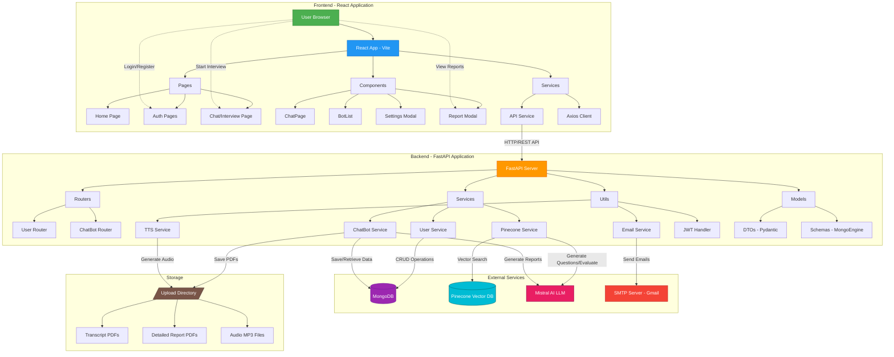

---

## 🔄 Data Flow Diagrams

### 1. User Authentication Flow

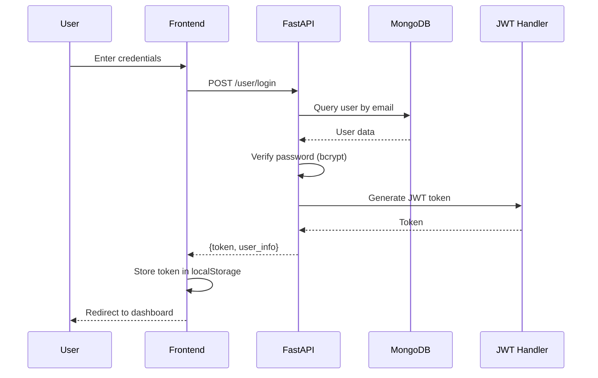

### 2. Interview Session Flow

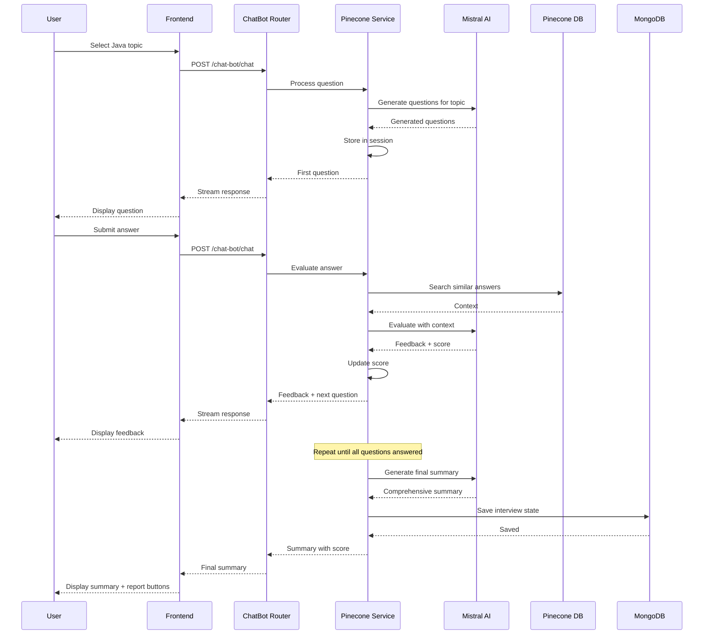

### 3. Report Generation & Email Flow

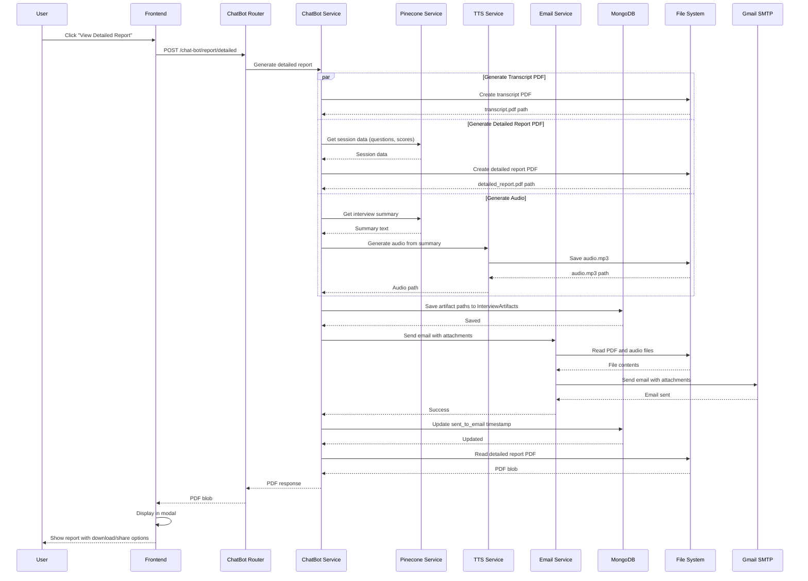

---

## 📊 Component Architecture

### Frontend Architecture

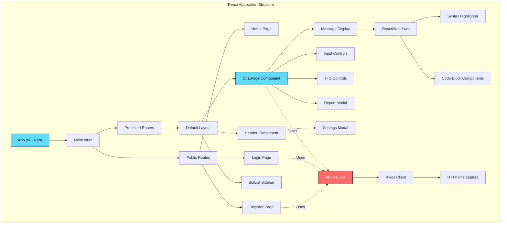

### Backend Architecture

```mermaid
graph TD
    subgraph "FastAPI Application Structure"
        A[app.py - Main] --> B[Router Registration]
        B --> C[User Router]
        B --> D[ChatBot Router]
        
        D --> E[ChatBot Endpoints]
        E --> F[/chat - Interview conversation]
        E --> G[/report/detailed - Generate report]
        E --> H[/history - Save/Get history]
        E --> I[/reset - Reset session]
        
        C --> J[User Endpoints]
        J --> K[/login - Authentication]
        J --> L[/register - Create account]
        J --> M[/settings - User preferences]
        
        F --> N[ChatBot Service]
        G --> N
        H --> N
        
        N --> O[Pinecone Service]
        N --> P[Email Service]
        N --> Q[TTS Service]
        
        O --> R[Mistral AI Integration]
        O --> S[Pinecone Vector DB]
        
        N --> T[MongoDB Operations]
        T --> U[User Collection]
        T --> V[KnowledgeBot Collection]
        T --> W[ChatTranscript Collection]
        T --> X[InterviewArtifacts Collection]
        T --> Y[UserSettings Collection]
    end
    
    style A fill:#FF6B35,stroke:#000,color:#fff
    style O fill:#4ECDC4,stroke:#000,color:#000
    style N fill:#95E1D3,stroke:#000,color:#000
```

---

## 🗄️ Database Schema

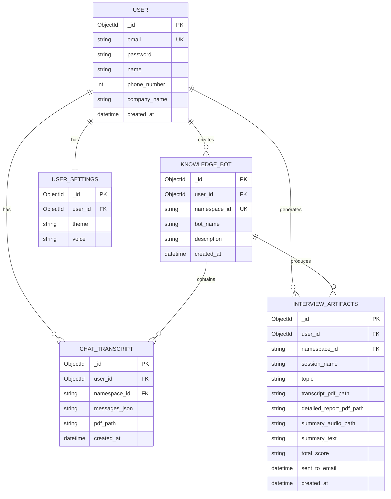

---

## 🔌 API Endpoints

### User Management

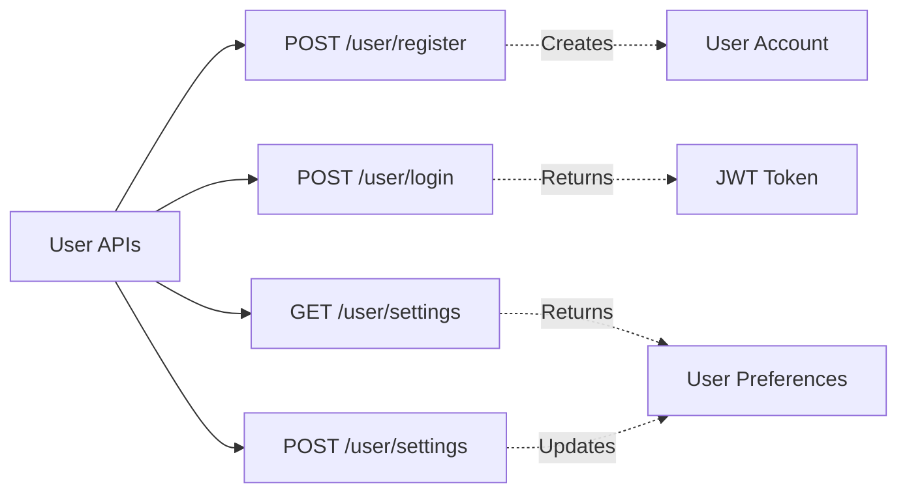

### ChatBot/Interview Management

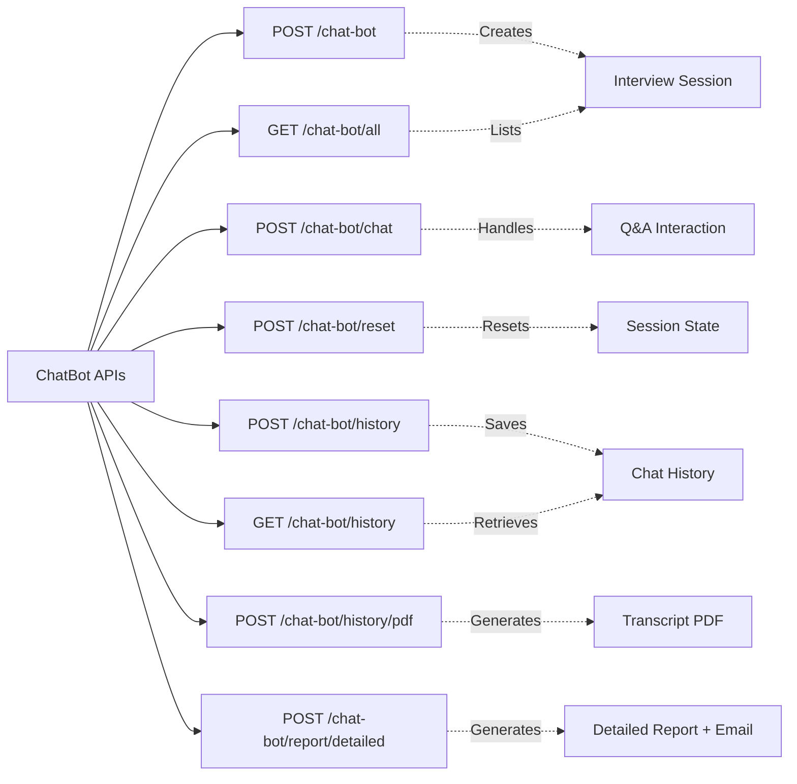

---

## 🎯 Key Features Architecture

### 1. Dynamic Question Generation

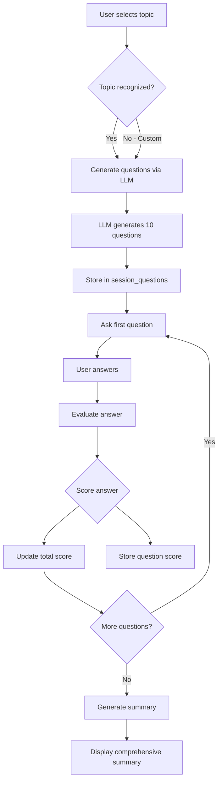

### 2. Email Delivery System

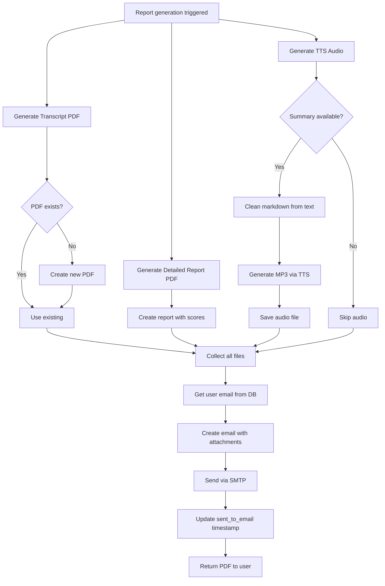

### 3. Text-to-Speech Processing

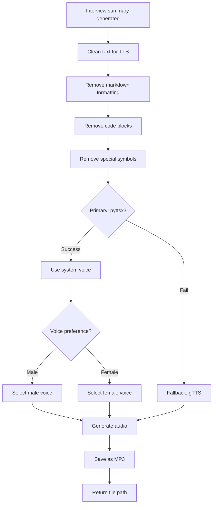

---

## 🔐 Security Architecture

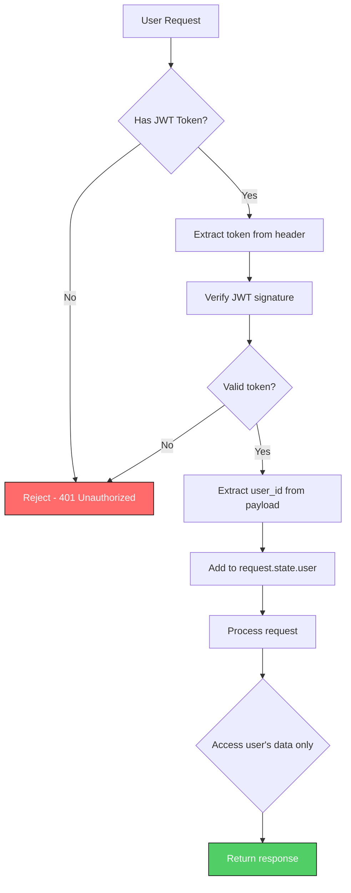

---

## 📁 File Structure

```
JavaSherpa/
├── frontend/                    # React application
│   ├── src/
│   │   ├── pages/              # Page components
│   │   │   ├── home/           # Landing page
│   │   │   ├── auth/           # Login/Register
│   │   │   └── default/        # Main interview interface
│   │   ├── components/         # Reusable components
│   │   ├── services/           # API calls
│   │   ├── router/             # Route management
│   │   └── utils/              # Helper functions
│   └── package.json
│
├── routers/                     # FastAPI route handlers
│   ├── user.py                 # User authentication routes
│   └── chat_bot.py             # Interview/chat routes
│
├── services/                    # Business logic
│   ├── user_service.py         # User operations
│   ├── chat_bot_service.py     # Interview management
│   └── pinecone_service.py     # LLM & vector operations
│
├── utils/                       # Utility functions
│   ├── email_service.py        # Email delivery
│   ├── tts_service.py          # Text-to-speech
│   ├── jwt.py                  # JWT handling
│   └── helper.py               # General helpers
│
├── models/                      # Data models
│   ├── dto.py                  # Pydantic request/response models
│   └── schemas.py              # MongoDB schemas
│
├── config/                      # Configuration
│   ├── constants.py            # App constants
│   └── mongodb.py              # DB connection
│
├── upload/                      # Generated files (gitignored)
│   └── {namespace_id}/
│       ├── transcripts/        # Conversation PDFs
│       └── reports/            # Detailed reports & audio
│
├── app.py                       # FastAPI main app
├── requirements.txt             # Python dependencies
└── .env                         # Environment variables (gitignored)
```

---

## 🚀 Deployment Architecture

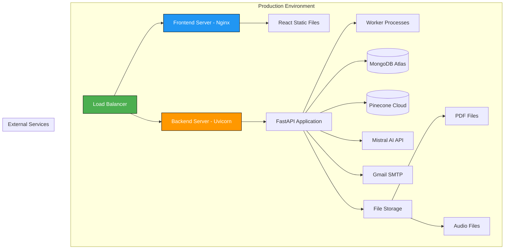

---

## 📊 Performance Considerations

### Caching Strategy
- Session data cached in Pinecone Service (in-memory)
- JWT tokens cached in frontend localStorage
- Vector search results cached temporarily

### Optimization Points
- Streaming responses for LLM interactions
- Lazy loading of chat history
- Compressed PDF generation
- Background email sending
- Efficient vector search in Pinecone

### Scalability
- Stateless backend (can scale horizontally)
- MongoDB for persistent storage
- Pinecone for vector operations
- File storage can be moved to S3/Cloud Storage

---

## 🔄 Key Interactions Summary

| Component | Interacts With | Purpose |
|-----------|----------------|---------|
| **Frontend** | Backend API | All user requests |
| **Backend** | MongoDB | User data, sessions, transcripts |
| **Backend** | Pinecone | Vector search, embeddings |
| **Backend** | Mistral AI | Question generation, evaluation, summaries |
| **Backend** | Gmail SMTP | Email delivery |
| **Backend** | File System | PDF & audio storage |
| **Pinecone Service** | All of above | Orchestrates LLM operations |

---

This architecture provides a scalable, maintainable, and feature-rich interview preparation system! 🚀
