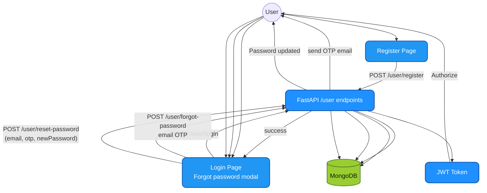

# JavaSherpa - Architecture Diagrams (Portrait / Print Friendly)

## 1) System Overview (Vertical)
```mermaid
graph TD
%% ---- Styles (kept simple for portrait rendering) ----
classDef ui fill:#2196F3,stroke:#0D47A1,color:#fff,stroke-width:1.5px,rx:10px,ry:10px;
classDef api fill:#1E90FF,stroke:#0B3D91,color:#fff,stroke-width:1.5px,rx:10px,ry:10px;
classDef data fill:#9ACD32,stroke:#4E7A1D,color:#0B1F00,stroke-width:1.5px,rx:10px,ry:10px;
classDef ext fill:#FFD700,stroke:#8A6D00,color:#1A1A1A,stroke-width:1.5px,rx:10px,ry:10px;

%% ---- User + Frontend ----
U((User))
Browser[Web Browser]:::ui
React[React SPA (Vite)<br/>Routing + UI]:::ui

Home[Home (/)]:::ui
About[About (/about)]:::ui
Login[Login (/login)<br/>OTP modal for forgot password]:::ui
Register[Register (/register)]:::ui
Protected[Protected /default<br/>ProtectedRoute]:::ui

Header[Header Layout (/default)]:::ui
BotList[BotList<br/>Create / List Sessions]:::ui
FileUpload[FileUpload<br/>Upload Materials]:::ui
ChatPage[ChatPage<br/>Voice STT/TTS, Markdown, Reports]:::ui
ClientCache[Browser localStorage<br/>(chat history cache)]:::ui

U --> Browser --> React
React --> Home
React --> About
React --> Login
React --> Register
React --> Protected
Protected --> Header
Protected --> BotList
Protected --> FileUpload
Protected --> ChatPage
ChatPage --> ClientCache

%% ---- Backend ----
API[FastAPI Server<br/>CORS + JWT Auth + Routers]:::api

UserRouter[User Router<br/>/user/*]:::api
ChatBotRouter[ChatBot Router<br/>/chat-bot/*]:::api
FilesRouter[Files Router<br/>/files/*]:::api

Services[Services Orchestrator]:::api
JWT[JWT Middleware]:::api

API --> UserRouter
API --> ChatBotRouter
API --> FilesRouter
API --> JWT
API --> Services

React -->|"HTTP requests"| API

%% ---- Data Stores ----
MongoDB[(MongoDB)]:::data
UploadDir[Server Upload Directory<br/>PDF/MP3 artifacts]:::data

UserRouter --> MongoDB
ChatBotRouter --> MongoDB
FilesRouter --> MongoDB
FilesRouter --> UploadDir
ChatBotRouter --> UploadDir

%% ---- External AI / Vector / Email ----
Pinecone[Vector DB (Pinecone)]:::ext
Mistral[Mistral AI<br/>Embeddings + Chat Responses]:::ext
EmailSMTP[Email (SMTP/Gmail)]:::ext

ChatBotRouter --> Pinecone
ChatBotRouter --> Mistral
ChatBotRouter --> EmailSMTP

%% ---- Key user interactions (portrait-friendly flow) ----
UserRouter -->|"forgot password OTP"| EmailSMTP
ChatPage -->|"POST chat-bot/chat (streaming)"| ChatBotRouter
ChatPage -->|"POST /history/pdf + /report/detailed"| ChatBotRouter
BotList -->|"POST chat-bot/"| ChatBotRouter
FileUpload -->|"POST files/fileUpload"| FilesRouter
```

## 2) Authentication + OTP Password Reset (Vertical)


## 3) Interview Session: Create → Upload → Chat → Report (Vertical)
```mermaid
graph TD
classDef ui fill:#2196F3,stroke:#0D47A1,color:#fff,stroke-width:1.5px,rx:10px,ry:10px;
classDef api fill:#1E90FF,stroke:#0B3D91,color:#fff,stroke-width:1.5px,rx:10px,ry:10px;
classDef data fill:#9ACD32,stroke:#4E7A1D,color:#0B1F00,stroke-width:1.5px,rx:10px,ry:10px;
classDef ext fill:#FFD700,stroke:#8A6D00,color:#1A1A1A,stroke-width:1.5px,rx:10px,ry:10px;

U((User))
Protected[Protected /default UI]:::ui
BotList[BotList<br/>Sessions]:::ui
Upload[FileUpload<br/>PDF Materials]:::ui
Chat[ChatPage<br/>Streaming chat + Voice]:::ui

API[FastAPI chat-bot + files routers]:::api
Pinecone[Vector DB (Pinecone)]:::ext
Mistral[Mistral AI]:::ext

Mongo[(MongoDB)]:::data
Artifacts[Upload Dir + Generated PDFs/MP3]:::data

U --> Protected
Protected --> BotList
BotList -->|"POST chat-bot/" (create session)"| API
BotList -->|"GET chat-bot/all"| API
API --> Mongo

Protected --> Upload
Upload -->|"GET files?chatBotId="| API
Upload -->|"POST files/fileUpload"| API
API --> Mongo
API --> Artifacts

Protected --> Chat
Chat -->|"POST chat-bot/chat (streaming)"| API
API --> Pinecone
API --> Mistral
API --> Mongo

Chat -->|"Save history: POST chat-bot/history"| API
Chat -->|"Reset: POST chat-bot/reset"| API

Chat -->|"Download transcript: POST chat-bot/history/pdf"| API
Chat -->|"Detailed report: POST chat-bot/report/detailed"| API
API --> Artifacts
```