# JavaSherpa - Architecture Diagrams (Portrait / Print Friendly)

## 1) System Overview (Vertical)
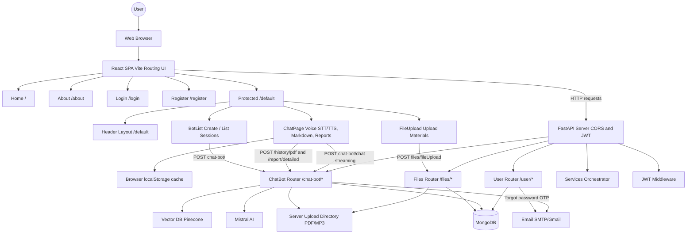

## 2) Authentication + OTP Password Reset (Vertical)
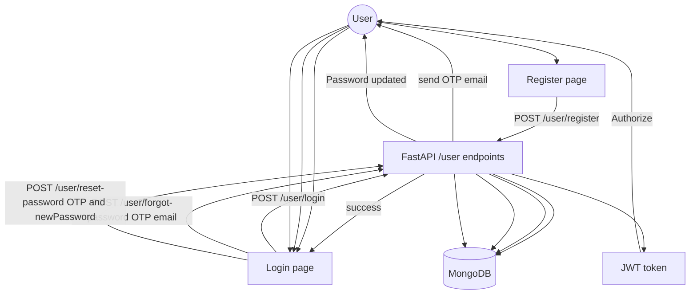

## 3) Interview Session: Create → Upload → Chat → Report (Vertical)
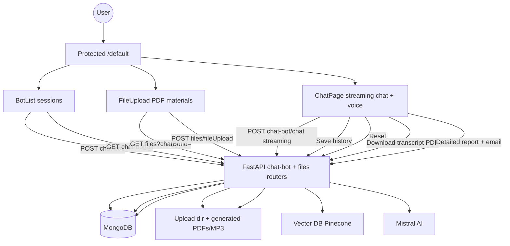

## 4) Component Architecture (Vertical)
### Frontend Architecture
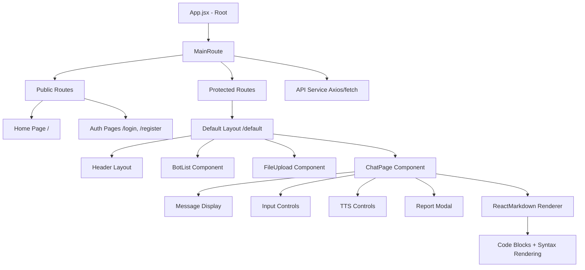

### Backend Architecture
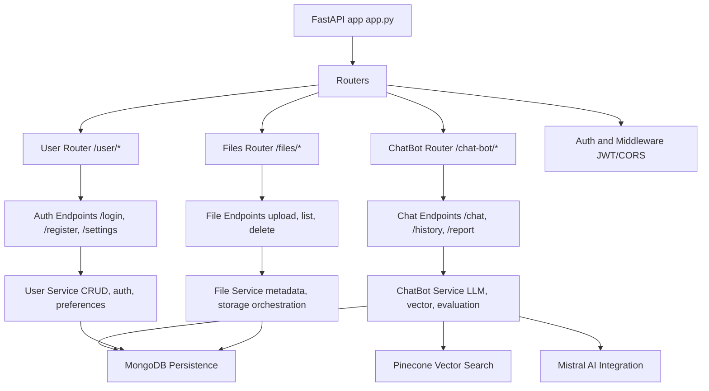

## 5) Database Schema (ER Diagram)
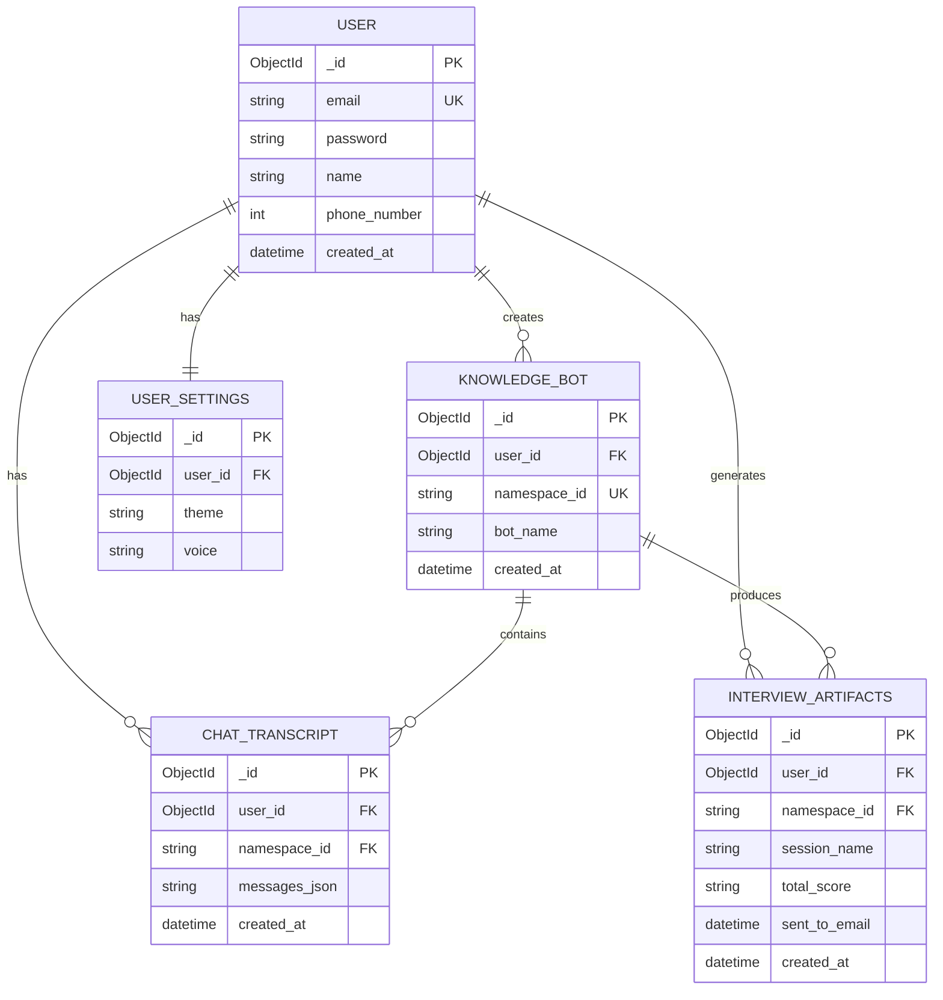

## 6) API Endpoints (Portrait-Friendly)
### User Management
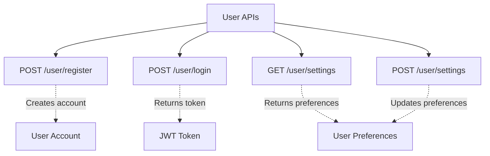

### ChatBot / Interview Management
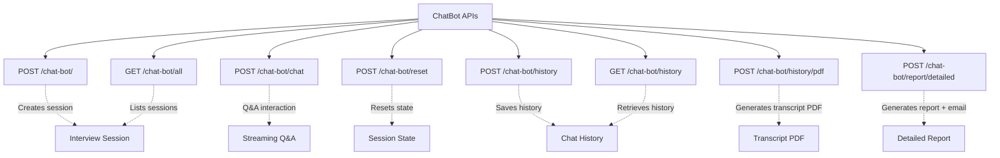

## 7) Key Feature Flows (Portrait-Friendly)
### Dynamic Question Generation
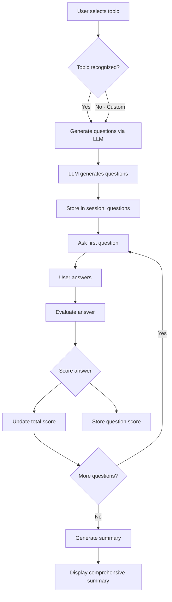

### Email Delivery System
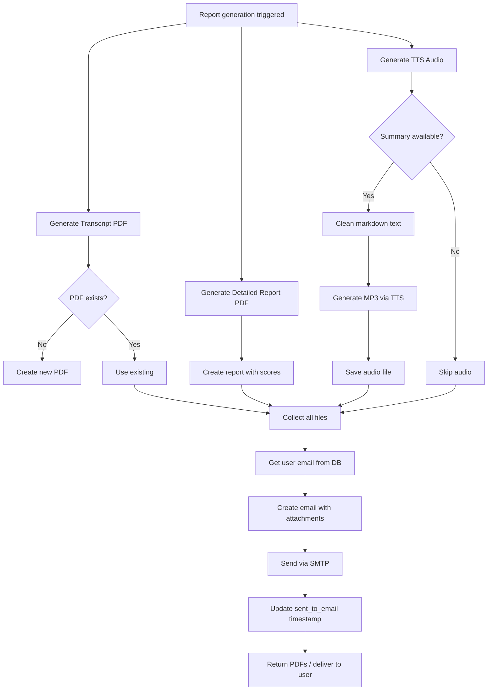

### Text-to-Speech Processing
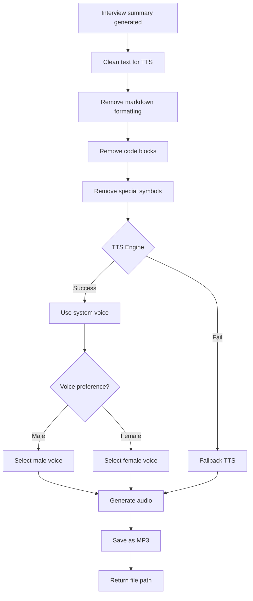

## 8) Security Architecture (Portrait-Friendly)
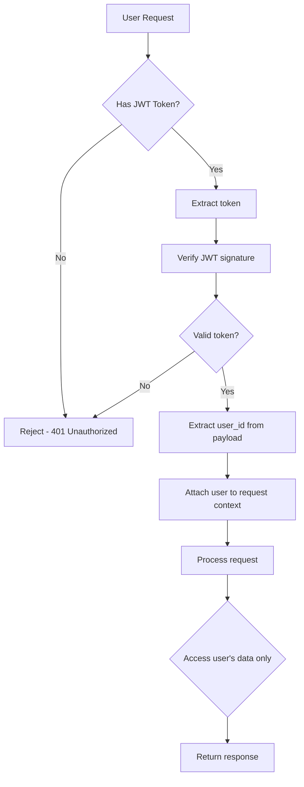

## 9) Deployment Architecture (Portrait-Friendly)
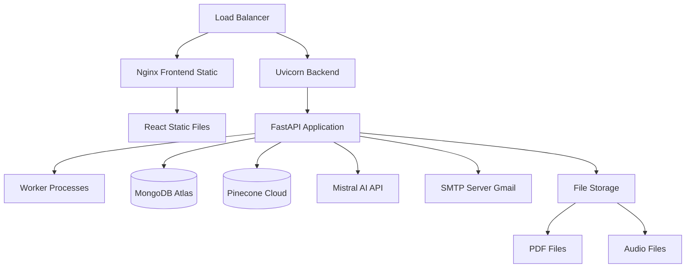